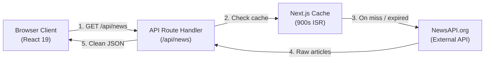

# Last247

> 24-hour global news briefing web app built with **Next.js 16**, **React 19**, and **Tailwind CSS v4**.

---

## Overview

- **Purpose**: Curates and summarizes top global news from the last 24 hours.
- **Beat Categorization**: Auto-tags stories into **Technology**, **Business**, **Science**, and **World**.
- **In-App Reader**: Slide-over drawer lets users read story details without page reloads.
- **Architecture**: Single Next.js full-stack monolith (React frontend + Node.js API proxy).

---

## Key Features

- **24h Rolling Feed**: Top 20 headlines via NewsAPI.
- **Keyword Classifier**: Auto-categorizes stories using headline and summary keywords.
- **Slide-Over Drawer**: Modal reader for full summary, body snippet, and source links.
- **Beat Accent Colors**: Blue (Tech), Amber (Business), Green (Science), Red (World).
- **Dark Mode**: Persistent theme toggle via `localStorage` and system preference.
- **Server Caching**: 15-minute (`900s`) Next.js cache to protect API quotas.

---

## Architecture & System Flow



---

## System Usage Representation

### Frontend Usage (User Actions)

| Step | User Action | Components | What Happens |
| :--- | :--- | :--- | :--- |
| **1. Page Load** | Opens `http://localhost:3000` | `Navbar`, `Hero`, `TopStories` | Reads theme from `localStorage`. Client calls `/api/news`. |
| **2. Feed Display** | Browses news list | `FeaturedStory`, `StoryCard` | Lead story shown on left; 19 stories listed on right. |
| **3. Open Story** | Clicks any story card | `NewsReaderAside` | Dispatches `last247:open-story`. Drawer slides in; page scroll locks. |
| **4. Close Story** | Presses `Esc` or clicks backdrop | `NewsReaderAside` | Drawer closes; page scroll unlocks. |
| **5. Switch Theme** | Clicks sun/moon icon | `Navbar` | Toggles `.dark` class on root HTML; updates `localStorage`. |

### Backend Usage (API Flow)

```
[Client] ──> GET /api/news
                │
                ├── Validates process.env.NEWS_API_KEY (returns 500 if missing)
                ├── Checks Next.js Data Cache (revalidate: 900)
                │     ├── Cache HIT  ──> Returns cached JSON immediately
                │     └── Cache MISS ──> Fetches https://newsapi.org/v2/top-headlines
                │
                └── Returns articles JSON to client (or 500 on network error)
```

---

## Team Usage Guides

### For Frontend Developers

- **Source Code**: `app/components/` and `app/page.tsx`.
- **Start Dev Server**: `npm run dev` (runs on `http://localhost:3000`).
- **Fetch News Data**: Call internal endpoint:
  ```ts
  const res = await fetch("/api/news");
  const data = await res.json(); // { status: "ok", articles: [...] }
  ```
- **Trigger Story Drawer**: Dispatch the custom window event from any card component:
  ```ts
  window.dispatchEvent(
    new CustomEvent("last247:open-story", { detail: storyObject })
  );
  ```
- **Theming & Colors**: Tailwind CSS v4 in `app/globals.css`. Use beat color classes:
  - `bg-blue` / `text-blue` (Technology)
  - `bg-amber` / `text-amber` (Business)
  - `bg-green` / `text-green` (Science)
  - `bg-red` / `text-red` (World)
- **Offline / Mocking Tip**: If API quota is exhausted during UI work, mock the `articles` array directly in `app/components/TopStories.tsx`.

---

### For Backend Developers

- **Source Code**: `app/api/news/route.ts`.
- **Environment Setup**: Add key to `.env.local`:
  ```env
  NEWS_API_KEY=your_news_api_key_here
  ```
- **Direct Endpoint Testing**:
  ```bash
  curl -i http://localhost:3000/api/news
  ```
- **Adjust Cache Lifespan**: Change cache duration in `app/api/news/route.ts`:
  ```ts
  // Change revalidate seconds (default: 900 = 15 mins)
  const response = await fetch(url.toString(), {
    next: { revalidate: 900 },
  });
  ```
- **Upstream Query Options**: NewsAPI query parameters configured in route:
  - `language`: `"en"`
  - `pageSize`: `"20"`
  - Upstream URL: `https://newsapi.org/v2/top-headlines`
- **Extending the API**: To add custom summarization, filter logic, or LLM enhancements, perform data transformations inside `app/api/news/route.ts` before returning `NextResponse.json(...)`.

---

## API Reference

### `GET /api/news`

Internal proxy route that queries NewsAPI.org and shields the secret key.

- **Method**: `GET`
- **Auth**: None (server handles API key)
- **Cache**: 15 minutes (`revalidate: 900`)

#### Response (`200 OK`)
```json
{
  "status": "ok",
  "totalResults": 20,
  "articles": [
    {
      "source": { "id": "wired", "name": "Wired" },
      "title": "Article title headline",
      "description": "Short article summary",
      "url": "https://example.com/story",
      "urlToImage": "https://example.com/image.jpg",
      "publishedAt": "2026-09-28T05:00:00Z",
      "content": "Article body snippet..."
    }
  ]
}
```

#### Error Responses (`500`)
- `{"error": "NEWS_API_KEY is not configured"}` — Missing key.
- `{"error": "Unable to fetch news"}` — Upstream API error or rate limit.

---

## Data Transformation Pipeline

`TopStories.tsx` converts raw articles before rendering:

1. **Filter**: Skips articles without titles or titled `"[Removed]"`.
2. **Category**: Keyword substring matching for `Technology`, `Business`, `Science`; defaults to `World`.
3. **Accent**: Maps category to `blue`, `amber`, `green`, or `red`.
4. **Read Time**: Word count / 200 WPM (`"X min read"`).
5. **Time Ago**: Formats publication date to `"X min ago"` or `"Xh ago"`.
6. **Clean Body**: Strips `[+123 chars]` truncation suffix from text.

---

## Environment Variables

Create `.env.local` in project root:

```env
NEWS_API_KEY=your_news_api_key_here
```

Get a free key from [newsapi.org](https://newsapi.org).

---

## Quickstart

### Prerequisites
- Node.js 20+
- npm / pnpm / yarn

### Run Locally
```bash
# 1. Install dependencies
npm install

# 2. Add API key
echo "NEWS_API_KEY=your_key_here" > .env.local

# 3. Start development server
npm run dev
```
Open [http://localhost:3000](http://localhost:3000).

### Build for Production
```bash
npm run build
npm run start
```

---

## Docker Setup

### Multi-stage `Dockerfile`

```dockerfile
FROM node:20-alpine AS deps
WORKDIR /app
COPY package.json package-lock.json ./
RUN npm ci

FROM node:20-alpine AS builder
WORKDIR /app
COPY --from=deps /app/node_modules ./node_modules
COPY . .
ENV NODE_ENV=production
RUN npm run build

FROM node:20-alpine AS runner
WORKDIR /app
ENV NODE_ENV=production
ENV PORT=3000
COPY --from=builder /app/public ./public
COPY --from=builder /app/.next/standalone ./
COPY --from=builder /app/.next/static ./.next/static
EXPOSE 3000
CMD ["node", "server.js"]
```

> **Note**: Add `output: "standalone"` to `next.config.ts` for standalone build.

---

## Project Structure

```
├── app/
│   ├── api/news/route.ts      # Backend route proxy to NewsAPI
│   ├── components/
│   │   ├── FeaturedStory.tsx  # Breaking lead story card
│   │   ├── Footer.tsx         # Site footer & back-to-top link
│   │   ├── Hero.tsx           # Page headline & stats
│   │   ├── Meet.tsx           # Creator info & channel links
│   │   ├── Navbar.tsx         # Navigation & theme toggle
│   │   ├── NewsReaderAside.tsx# Slide-over story reader drawer
│   │   ├── StoryCard.tsx      # News feed card item
│   │   └── TopStories.tsx     # Client orchestrator: fetch & filter
│   ├── globals.css            # Tailwind v4 styles & theme tokens
│   ├── layout.tsx             # Root layout & Google fonts
│   └── page.tsx               # Main page composition
├── public/                    # Static SVG assets
├── .env.local                 # Secret keys (not in git)
├── next.config.ts             # Next.js configuration
├── package.json               # Dependencies & scripts
└── tsconfig.json              # TypeScript config
```

---

## Troubleshooting

| Problem | Cause | Fix |
| :--- | :--- | :--- |
| **500: Key not configured** | Missing `.env.local` | Add `NEWS_API_KEY=...` to `.env.local` and restart dev server. |
| **500: Unable to fetch news** | NewsAPI rate limit hit (100 req/day on free plan) | Wait for quota reset or verify key on NewsAPI dashboard. |
| **HTTP 426 on Production** | NewsAPI free plan only allows `localhost` | Upgrade NewsAPI plan or swap news provider in production. |
| **"Meet" link in nav fails** | ID mismatch (`id="contact"` vs `#meet`) | Change `<section id="contact">` in `Meet.tsx` to `id="meet"`. |

---

## Architecture Evaluation: Node.js vs Python

- **Current Architecture**: 100% TypeScript / Node.js monolith.
- **Keep in Node.js**: Entire app. Next.js handles route proxying, ISR caching, and React rendering with zero inter-service network hops.
- **Python Recommendation**: **Do not add Python** unless running offline ML models (PyTorch / Hugging Face embeddings) or custom scrapers (Scrapy). For API proxying and LLM streaming, Node.js/TypeScript is faster, lighter, and easier to maintain.
