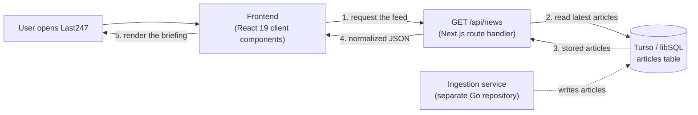

# Last247

> A 24-hour global news briefing **frontend/UI** project built with **Next.js 16**, **React 19**, **TypeScript**, and **Tailwind CSS v4**.

This repository is a **local development UI project**. It runs entirely on your machine — no Docker, no cloud account, no production infrastructure.

---

## Overview

Last247 renders a briefing of the most important stories from the last 24 hours.

The application is **database-first**. News is collected continuously by a **separate ingestion service** and stored in a **Turso (libSQL) database**. This repository only ever *reads* that stored news and presents it.

- **Purpose**: Present stored news clearly — categories, timestamps, sources, and an in-app reader.
- **Responsibility**: Request the normalized feed from the backend and render it.
- **Out of scope**: Collecting news, choosing news sources, and processing external APIs.

### What the frontend does

- Renders the lead story, the story list, categories, relative timestamps, and read times.
- Opens the story reader drawer.
- Handles loading, unavailable, empty, and malformed-record states.
- Switches between light and dark themes.

### What the frontend never does

- No news-provider API keys, and no provider selection.
- No calls to NewsAPI, GNews, NewsData.io, or any other external news API.
- No triggering of the ingestion service.
- No fallback to an external API when the database is empty.

If the database has nothing to show, the UI says so. It never goes looking for news itself.

---

## Tech Stack

| Layer | Technology | Notes |
| :--- | :--- | :--- |
| Framework | **Next.js 16.3** (App Router) | Serves the UI and the `/api/news` route handler. Turbopack is the default builder. |
| UI library | **React 19.2** | Client components in `app/components/`. |
| Language | **TypeScript 5** | `strict` mode, configured in `tsconfig.json`. |
| Styling | **Tailwind CSS v4** | CSS-first configuration in `app/globals.css` (no `tailwind.config.js`). |
| Icons | **lucide-react** | Inline SVG icon set. |
| Fonts | `next/font/google` → Plus Jakarta Sans | Loaded in `app/layout.tsx`. |
| Database client | **@libsql/client 0.18** | Reads the Turso database. Used only server-side, in `app/api/news/db.ts`. |
| Linting | **ESLint 9** + `eslint-config-next` | `npm run lint`. |
| Package manager | **npm** | `package-lock.json` is the committed lockfile. |
| Testing | — | No test runner is configured. |
| Docker / CI / Cloud | — | **Not part of this project.** |

---

## Local Development

### Prerequisites

- **Node.js 20.9+** (Next.js 16 requires 20.9 or newer; this project is developed on Node 22).
- **npm 10+**.

### Steps

```bash
# 1. Install dependencies
npm install

# 2. Configure the database connection
cp .env.example .env.local
# then edit .env.local:
#   TURSO_DATABASE_URL=libsql://your-database.turso.io
#   TURSO_AUTH_TOKEN=your-token        # remote databases only
#
# For offline UI work you can point at a local file instead:
#   TURSO_DATABASE_URL=file:./news.db

# 3. Start the dev server
npm run dev
```

Open **http://localhost:3000**.

### Scripts

| Command | What it does |
| :--- | :--- |
| `npm run dev` | Starts the dev server on http://localhost:3000 with hot reload. |
| `npm run build` | Creates an optimized production build in `.next/`. |
| `npm run start` | Serves the production build locally on http://localhost:3000. |
| `npm run lint` | Runs ESLint. |

### Environment variables

| Variable | Required | Purpose |
| :--- | :--- | :--- |
| `TURSO_DATABASE_URL` | Yes | Turso connection string, or `file:./news.db` for local work. |
| `TURSO_AUTH_TOKEN` | Remote only | Turso auth token. Leave empty for a local file. |

These are the **only** environment variables this project reads. `.env.local` is git-ignored, and `.env.example` documents the shape.

---

## Architecture



**The ingestion service is not part of this repository.** It is a separate Go service that collects news on a schedule and writes rows into the database. Last247 only ever reads.

### Request flow

```text
User opens Last247
        ↓
Frontend requests /api/news
        ↓
Backend reads Turso
        ↓
Frontend receives stored news
        ↓
UI renders Last247 feed
```

### The `articles` table

`GET /api/news` reads a single table. The ingestion service owns it; Last247 only selects from it.

```sql
CREATE TABLE articles (
  id           TEXT PRIMARY KEY,
  source_id    TEXT,
  source_name  TEXT NOT NULL,
  title        TEXT NOT NULL,
  description  TEXT,
  content      TEXT,
  url          TEXT NOT NULL,
  url_to_image TEXT,
  author       TEXT,
  published_at TEXT NOT NULL,   -- ISO 8601
  ingested_at  TEXT             -- ISO 8601, used as a fallback timestamp
);

CREATE INDEX idx_articles_published_at ON articles (published_at DESC);
```

The query is deliberately simple — the 20 most recent articles, newest first:

```sql
SELECT * FROM articles ORDER BY published_at DESC LIMIT 20;
```

If your database uses different column names, adjust `SELECT_LATEST` in `app/api/news/db.ts` and the field reads in `app/api/news/normalize.ts`. Nothing else needs to change.

---

## API Reference

### `GET /api/news`

The only endpoint the frontend calls. A read-only projection of the database.

- **Method**: `GET`
- **Auth**: none from the browser — database credentials stay server-side.
- **Caching**: `Cache-Control: public, s-maxage=60, stale-while-revalidate=300`.
- **Rendering**: always executed at request time (`dynamic = "force-dynamic"`), so the feed is never baked into a build.

#### Response (`200 OK`)

```json
{
  "status": "ok",
  "totalResults": 20,
  "articles": [
    {
      "source": { "id": "reuters", "name": "Reuters" },
      "title": "Article title headline",
      "description": "Short article summary",
      "url": "https://example.com/story",
      "urlToImage": "https://example.com/image.jpg",
      "publishedAt": "2026-09-28T05:00:00Z",
      "content": "Article body snippet...",
      "author": "Reuters Staff"
    }
  ],
  "meta": {
    "counts": { "returned": 20, "skipped": 0 }
  }
}
```

Every article has the same shape regardless of where the story was collected, so the UI never needs to know how it got there. `meta.counts.skipped` reports stored rows that could not be rendered.

#### Error responses

| Status | Body | Meaning |
| :--- | :--- | :--- |
| `503` | `{"error": "news_unavailable"}` | The database could not be read. |
| `500` | `{"error": "news_not_configured"}` | `TURSO_DATABASE_URL` is not set. |

Both are deliberately opaque. The details are logged server-side and never shown to the user.

### UI states

`app/components/TopStories.tsx` maps the response to one of five states:

| State | Trigger | What the user sees |
| :--- | :--- | :--- |
| `loading` | Request in flight | Skeleton placeholders. |
| `ready` | `200` with at least one article | The briefing. A muted "N records skipped" note appears if some rows were unreadable. |
| `empty` | `200`, no articles, nothing skipped | "No stories have been collected yet" — the feed is waiting for the next collection cycle. |
| `invalid` | `200`, no articles, at least one skipped | "No stories could be displayed" — the stored records are incomplete. |
| `unavailable` | `503`, `500`, or a network error | "The news feed is temporarily unavailable", with a **Try again** button. |

An empty database **never** triggers a request to any external news API.

---

## System Usage

### Frontend (user actions)

| Step | User action | Components | What happens |
| :--- | :--- | :--- | :--- |
| **1. Page load** | Opens `http://localhost:3000` | `Navbar`, `Hero`, `TopStories` | Theme is read from `localStorage`/system preference. `TopStories` requests `/api/news`. |
| **2. Feed display** | Browses the news list | `FeaturedStory`, `StoryCard` | Lead story on the left, the rest in a scrollable column on the right. |
| **3. Open story** | Clicks any story card | `NewsReaderAside` | Dispatches the `last247:open-story` window event; the drawer slides in and page scroll locks. |
| **4. Close story** | Presses `Esc` or clicks the backdrop | `NewsReaderAside` | Drawer closes and page scroll unlocks. |
| **5. Switch theme** | Clicks the sun/moon icon | `Navbar` | Toggles the `.dark` class on `<html>` and updates `localStorage`. |

### Backend (`GET /api/news`)

```
[Client] ──> GET /api/news
                │
                ├── TURSO_DATABASE_URL set?          (no)  ──> 500 news_not_configured
                │
                ├── SELECT * FROM articles
                │     ORDER BY published_at DESC
                │     LIMIT 20
                │        ├── query fails            ──> 503 news_unavailable
                │        └── rows returned
                │
                ├── Normalize each row
                │     ├── missing/placeholder title  ──> skipped
                │     ├── missing url                ──> skipped
                │     ├── no usable timestamp       ──> skipped
                │     │     (published_at, else ingested_at)
                │     └── otherwise                 ──> normalized article
                │
                └── 200 { status, totalResults, articles, meta.counts }
```

### Article normalization

`app/api/news/normalize.ts` turns a database row into the article shape the UI expects. An article needs three things to be renderable: a real title, a link, and a usable timestamp. Rows missing any of them are counted as `skipped` and left out of the feed — the UI is built around a rolling 24-hour window, so a story with no timestamp cannot be placed in it.

---

## Working on the Frontend

- **Source**: `app/components/` and `app/page.tsx`.
- **Open the drawer from any component**:
  ```ts
  window.dispatchEvent(
    new CustomEvent("last247:open-story", { detail: storyObject })
  );
  ```
- **Theming & colors**: Tailwind v4 tokens live in `app/globals.css`. Beat accents are `bg-blue` / `text-blue` (Technology), `bg-amber` / `text-amber` (Business), `bg-green` / `text-green` (Science), `bg-red` / `text-red` (World).
- **Offline / mocking tip**: if you have no database available, mock the `articles` array directly in `app/components/TopStories.tsx` while working on layout.

The transformations in `TopStories.tsx` — category keywords, accent mapping, relative timestamps, and read time — are presentation concerns and belong in the UI. Collecting and normalizing incoming data does not.

---

## Project Structure

```
.
├── app/
│   ├── api/news/
│   │   ├── route.ts         # GET /api/news — returns the normalized feed
│   │   ├── db.ts            # Turso/libSQL client and the articles query
│   │   ├── normalize.ts     # Row → article mapping, malformed-row filtering
│   │   └── types.ts         # NewsArticle contract shared with the client
│   ├── components/
│   │   ├── FeaturedStory.tsx   # Lead story card
│   │   ├── Footer.tsx          # Site footer & back-to-top link
│   │   ├── Hero.tsx            # Page headline & stats
│   │   ├── Navbar.tsx          # Navigation & theme toggle
│   │   ├── NewsReaderAside.tsx # Slide-over story reader drawer
│   │   ├── StoryCard.tsx       # News feed card item
│   │   └── TopStories.tsx      # Client orchestrator: fetch, convert, states
│   ├── globals.css         # Tailwind v4 styles & theme tokens
│   ├── layout.tsx          # Root layout & Google fonts
│   └── page.tsx            # Main page composition
├── public/                 # Static assets (served at the site root)
├── .env.example            # Environment variable template
├── .env.local              # Your database credentials (git-ignored)
├── next.config.ts          # Next.js configuration
├── package.json            # Dependencies & scripts
└── tsconfig.json           # TypeScript config
```

> `AGENTS.md` and `CLAUDE.md` are generated automatically by `next dev`. They are git-ignored rather than committed.

---

## Troubleshooting

| Problem | Likely cause | Fix |
| :--- | :--- | :--- |
| **500 `news_not_configured`** | `TURSO_DATABASE_URL` is not set | Add it to `.env.local` and restart the dev server. |
| **503 `news_unavailable`** | The database could not be read — bad URL, missing token, or the `articles` table does not exist | Check the server log for the underlying error, then verify the connection string and schema. |
| **"No stories have been collected yet"** | The `articles` table is empty | Expected. The ingestion service populates it on its own schedule; Last247 will not fetch news to fill the gap. |
| **"No stories could be displayed"** | Every stored row is missing a title, link, or timestamp | Inspect the rows and fix the ingestion service writing them. |
| **"N records skipped" note under the feed** | Some recent rows are incomplete | The rest of the feed is still valid. Check `meta.counts.skipped` via the endpoint below. |
| **Env change not picked up** | Next.js only reads env at startup | Stop and restart the dev server after editing `.env.local`. |

Inspect the live feed with:

```bash
curl -s http://localhost:3000/api/news
```
